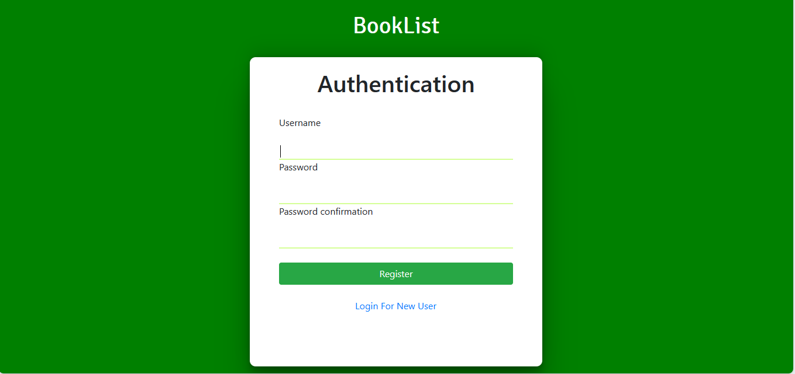
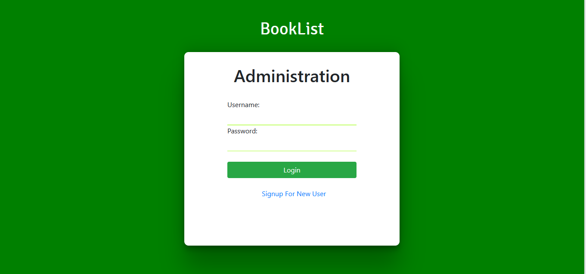
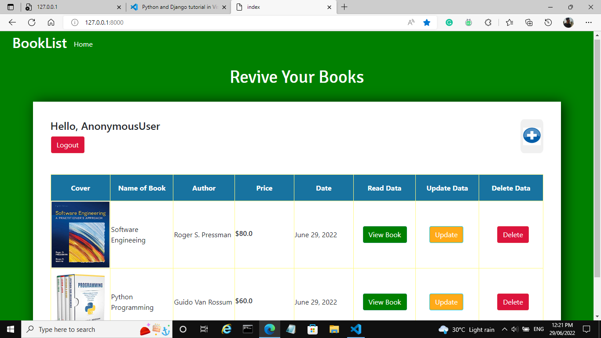
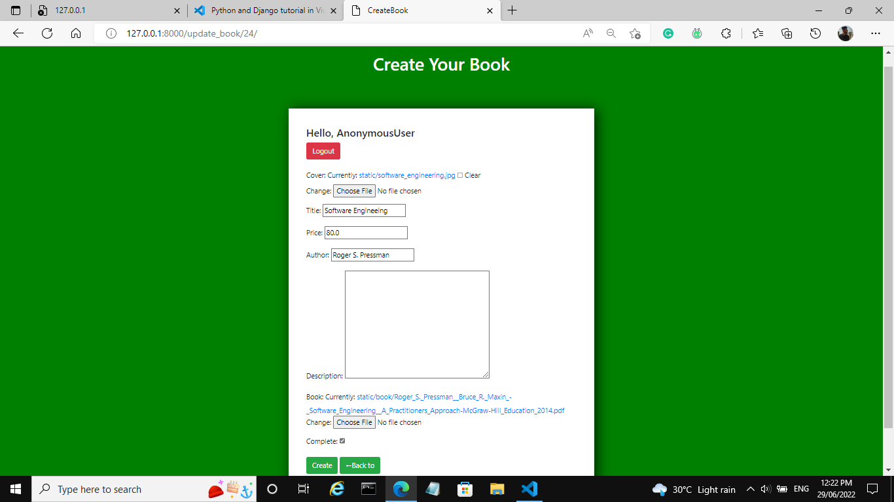
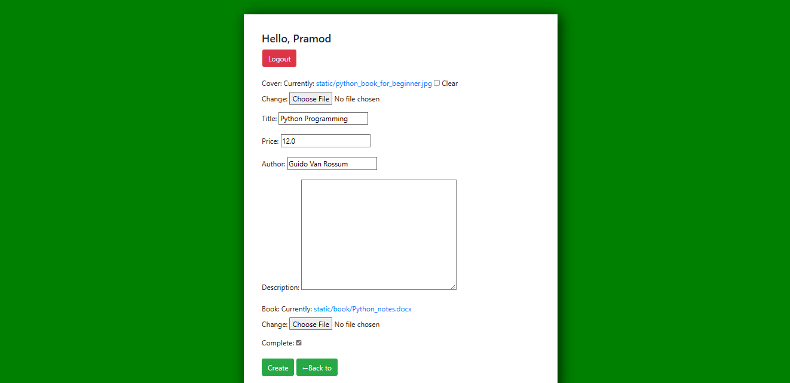
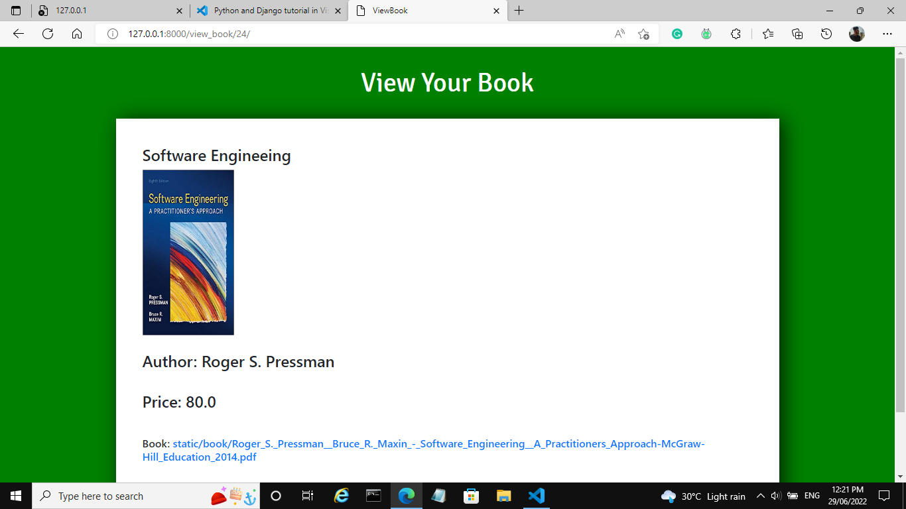
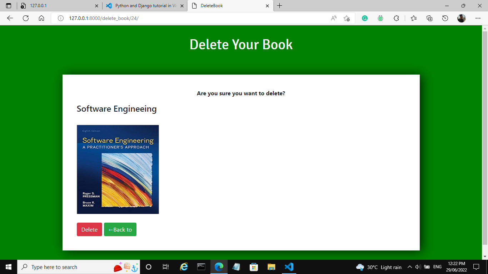

# BookList
Booklist is a library management system website based on CRUD app that registered users to create, update, retrieve, and delete the books from the website and to store their data using class-based views. This project uses ORM (object relational mapping) to store the data on the SQLLite Database. 

## Prerequisites
   * Python (version 3.7.1)
   * Django (version 3.2.9)
   
# Database Setup
python manage.py makemigrations.
 
python manage.py migrate.

## Usage
# Start the server:
python manage.py runserver

# Screenshots:

 

 

 

 

 

 

